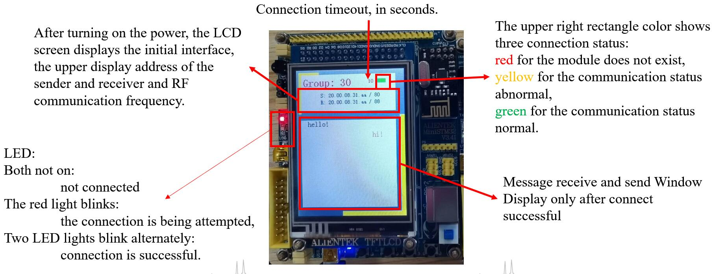
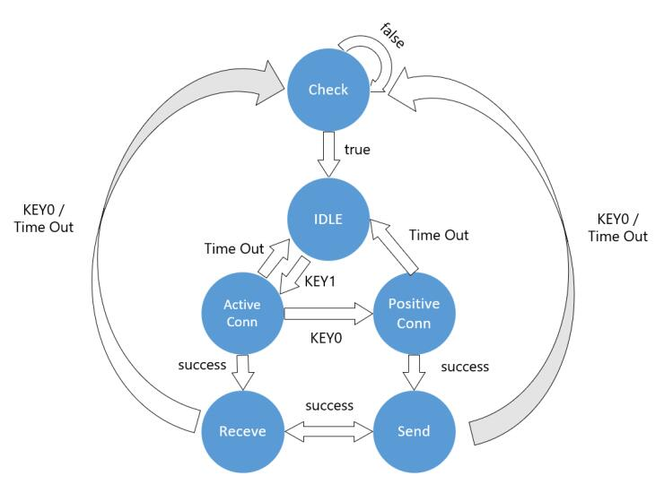

# CS301 Wireless Communication

## Brief
CS301 Embedded System and Microcomputer Principle course project in SUSTech 2020-Fall.

The main content is to establish the connection communication between two embedded development boards through the 2.4G communication module nRF24L01, and input the data through COM(cluster *com*munication port) to display the communication content on the LCD screen.

 

## Development environment

OS: Windows 10

IDE: STM32CubeIDE  Version: 1.3.0  Build: 5720_20200220_1053 (UTC)

 

## Quick start

STM32CubeIDE  --> File --> Open Projects from File System... --> Choose folder *Wireless_Communications*  --> Finish

Fig. 1 Quick start

  

Fig. 2 Overview

  

## Design

#### FSM

Fig. 3  FSM

  

The connection state is detected by heartbeat mechanism.

  

More detail in [CS301 Gropu30 Project Report](./doc/Project_Report.pdf),  [CS301 Gropu30 User Manual](./doc/User_Manual.pdf)

  

